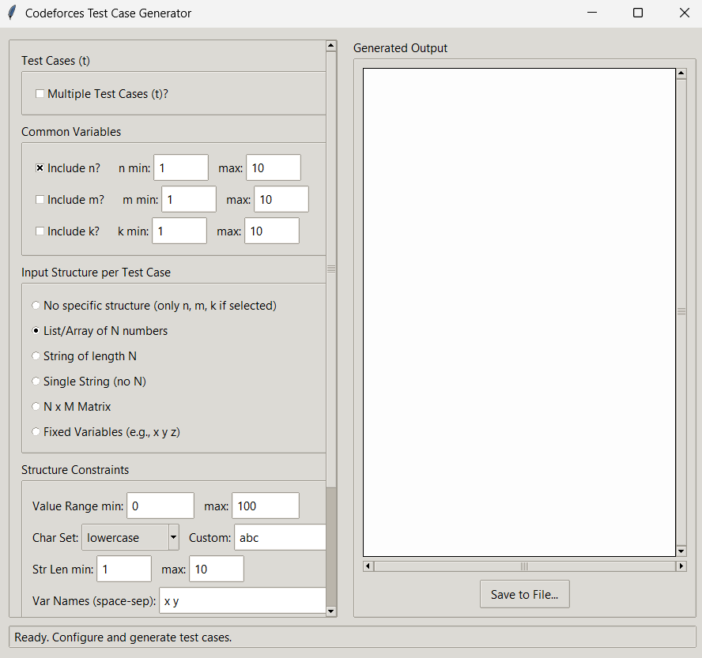

# Codeforces Test Case Generator GUI

A user-friendly desktop application built with Python and Tkinter (ttk) to generate customizable test cases for competitive programming problems, particularly useful for platforms like Codeforces, LeetCode, etc.



## Features

* **Graphical User Interface:** Easy-to-use interface for configuring and generating test cases.
* **Multiple Test Cases:** Generate a specific number of test cases (`t`) or a single case.
* **Common Variables:** Include common variables like `n`, `m`, `k` with user-defined minimum and maximum value ranges.
* **Flexible Input Structures:** Supports various common input formats per test case:
    * List/Array of N numbers
    * String of length N
    * Single String (variable length)
    * N x M Matrix
    * Fixed number of named variables (e.g., x y z)
    * No specific structure (only n, m, k if selected)
* **Customizable Constraints:**
    * Define value ranges (min/max) for numbers in lists, matrices, or fixed variables.
    * Specify character sets for strings (lowercase, uppercase, digits, alphanumeric, or custom).
    * Set length ranges (min/max) for single strings.
* **Query Generation:** Optionally add a specified number of queries (`Q`) after the main input, with configurable count and value ranges for query parameters.
* **Theming & Styling:** Uses `ttk` themes for a native look and feel, with custom styling for key elements like buttons. Attempts to select appropriate themes for Windows/macOS.
* **Responsive UI:**
    * Scrollable configuration panel for handling many options.
    * Asynchronous generation prevents the UI from freezing during potentially long generation processes.
* **Output Management:**
    * Displays generated test cases in a dedicated text area.
    * Allows easy saving of the generated output to a file (`.txt`, `.in`, etc.).
* **User Feedback:** Status bar provides informative messages about readiness, generation progress, success, warnings, and errors.

## Requirements

* **Python 3.x:** The script is written for Python 3.
* **Tkinter:** Python's standard GUI package.
    * **Windows/macOS:** Tkinter is usually included with the standard Python installation.
    * **Linux:** You might need to install it separately using your package manager. Examples:
        * Debian/Ubuntu: `sudo apt-get update && sudo apt-get install python3-tk`
        * Fedora: `sudo dnf install python3-tkinter`

## Installation

1.  Ensure you have Python 3 and Tkinter installed (see Requirements).
2.  Save the script code as `test_case_generator.py`.
3.  No further installation steps are needed.

## Usage

1.  **Open a Terminal or Command Prompt:**
    * Windows: `cmd` or `PowerShell`
    * macOS/Linux: `Terminal`
2.  **Navigate to the Directory:** Use the `cd` command to go to the folder where you saved `test_case_generator.py`.
    ```bash
    cd path/to/your/script/directory
    ```
3.  **Run the Script:** Execute the script using Python.
    ```bash
    python test_case_generator.py
    ```
    (Or use `python3` if `python` points to Python 2 on your system).
4.  **Use the GUI:**
    * The "Codeforces Test Case Generator" window will appear.
    * **Configure:** Use the options in the left panel to set up your desired test case structure and constraints (number of cases `t`, variables `n/m/k`, input type, value ranges, string settings, queries, etc.).
    * **Generate:** Click the "Generate Test Cases" button. The UI might briefly show "Generating..." and the button will be disabled.
    * **View Output:** The generated test cases will appear in the "Generated Output" text area on the right.
    * **Save:** Click the "Save to File..." button to save the content of the output area to a text file (`.txt`, `.in`, etc.).
    * **Status:** Check the status bar at the bottom for feedback (Ready, Generating..., Success, Warnings, Errors).

## Contributing

Contributions are welcome! If you have suggestions for improvements or find bugs, feel free to open an issue or submit a pull request on the repository (if applicable).

## License

This project is licensed under the MIT License - see the [LICENSE](LICENSE) file for details.

Example: This project is licensed under the MIT License - see the LICENSE.md file for details.
